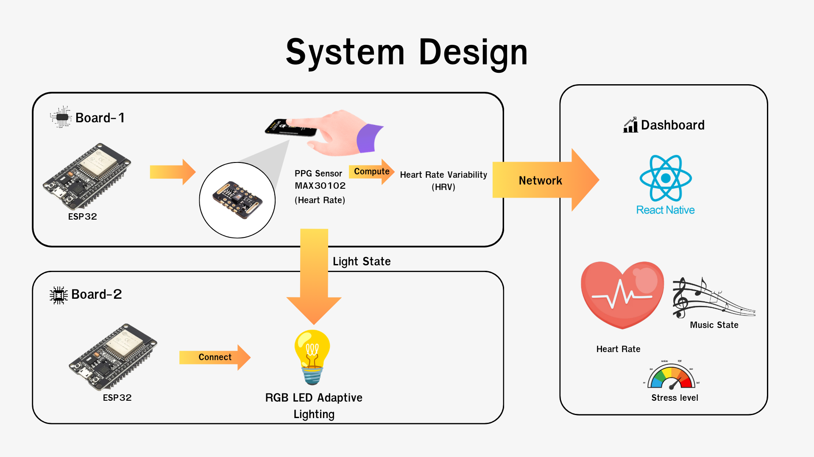

# Project : NeuroCalm

## ที่มาและแนวคิดการออกแบบ
ในปัจจุบันประเทศไทยกำลังเจ้าสู่สังคมผู้สูงอายุ ในขณะที่ผู้สูงอายุเพิ่มขึ้น วัยทำงานและวัยเด็กมีจำนวนลดลง ทำให้ผู้สูงอายุจำนวนมากต้องอยู่เพียงลำพัง จนเกิดภาวะโดดเดี่ยว ซึ่งเป็นจุดเริ่มต้นของความเครียดที่ส่งผลต่อทั้งสุขภาพกายและสุขภาพจิต เช่น อัตราการเต้นของหัวใจสูง ความวิตกกังวล และการพักผ่อนไม่เพียงพอ ดังนั้นจึงเกิดแนวคิดในการพัฒนา NeuroCalm ซึ่งเป็นระบบช่วยผ่อนคลายอัตโนมัติที่ผสานเทคโนโลยีเซนเซอร์ชีวภาพ แสงบำบัด และเสียงดนตรีเข้าด้วยกัน

## แนวคิดหลักของการออกแบบคือ
ใช้ข้อมูลชีวสัญญาณจริงของผู้ใช้ (Real-time biofeedback) เพื่อประเมินระดับความเครียด
ปรับสภาพแวดล้อมให้เหมาะสมแบบอัตโนมัติ เช่น สีไฟ ความสว่าง และเสียงเพลง
ให้ผู้ใช้สามารถควบคุมและปรับแต่งระบบผ่าน Dashboard ได้สะดวก
ระบบแบ่งเป็น 3 ส่วนหลัก

1. ระบบตรวจวัดชีพจร (PPG Sensor) ตรวจจับอัตราการเต้นหัวใจเพื่อนำมาวิเคราะห์ระดับความตื่นตัวของร่างกาย

2. ระบบไฟบำบัด (Light Therapy Module) ปรับสีและความสว่างของไฟเพื่อช่วยลดความเครียดและกระตุ้นการผ่อนคลาย

3. ระบบ Dashboard ควบคุม ใช้สำหรับเปิดเพลง เลือกโหมดผ่อนคลาย และตั้งค่าระบบทั้งหมด

การออกแบบทั้งหมดเน้นหลัก Human-Centered Design คือให้เทคโนโลยีตอบสนองต่อสภาวะร่างกายและอารมณ์ของผู้ใช้แบบอัตโนมัติ เพื่อสร้างประสบการณ์การผ่อนคลายที่เป็นธรรมชาติที่สุด



## รายการอุปกรณ์ที่ใช้
### Board 1 : ส่วนตรวจวัดชีพจร
- ไมโครคอนโทรลเลอร์ ESP32
- เซนเซอร์ PPG (เช่น MAX30102 / Pulse Sensor) link

PowerBank
### Board 2 : ส่วนไฟบำบัด
- ไมโครคอนโทรลเลอร์ ESP32
- ไฟ NeoPixel หรือไฟ LED RGB

## Source code 
```bash 
repository
│
├── README.md
├── asset
│   └── designsystem.png
│
├── app
│   └── main.py
│
└── src
    ├── board1
    │   ├── board1.ino
    │   └── config.h
    │
    └── board2
        ├── board2.ino
        └── config.h
```

## Set up React Native 
```bash
cd app
npm install
npm start android
# or
npm start ios
```

## โค้ดไมโครคอนโทรลเลอร์ (Microcontroller Code)

1. เปิด sketch ใน Arduino IDE

2. แก้ไขไฟล์การตั้งค่า
```
config.h
```

3. ทำการ อัปโหลด (Upload) โค้ด ลงบอร์ด ESP32 เพื่อเริ่มใช้งานระบบ